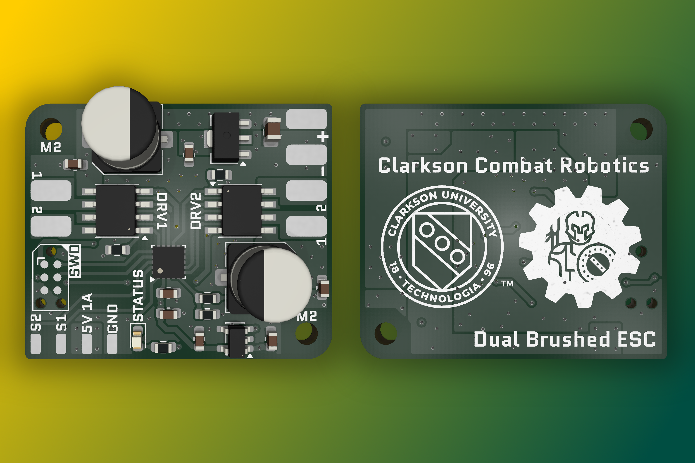
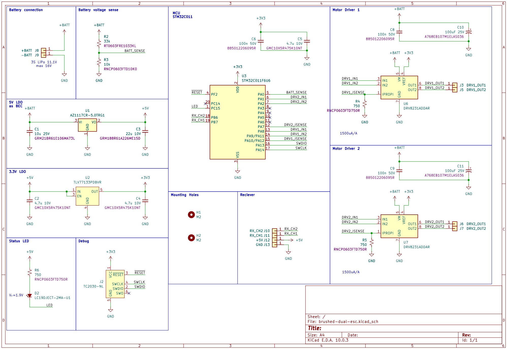
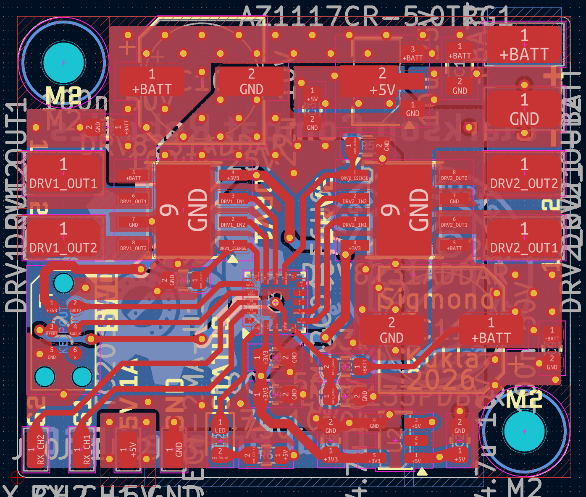
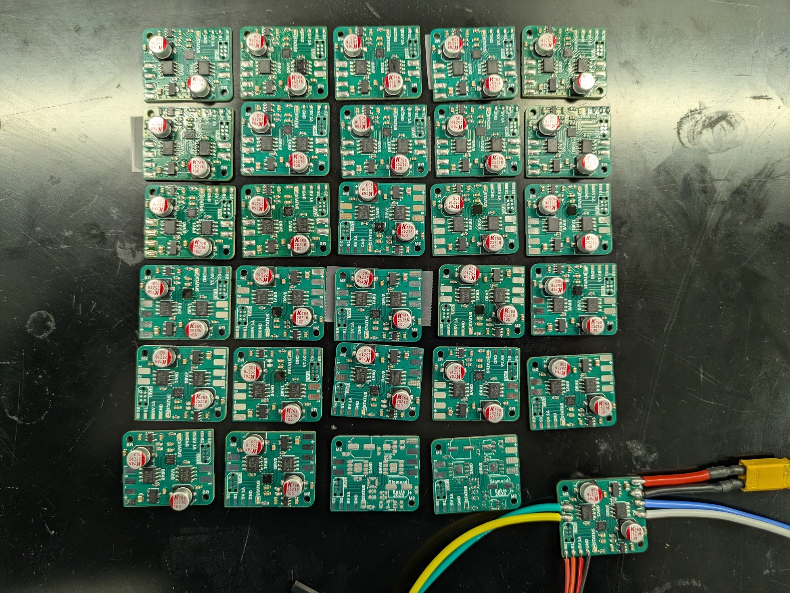

# brushed-dual-esc
**Clarkson University Combat Robotics SPEED Team**

## Summary

Dual drive ESC for Clarkson Combat Robotics 1lb freshman PLAnt competition.
Supports two 3A brushed drive motors and includes a 5V 1A BEC output to power a receiver. 

## Details

The ESC implements an STM32C011 MCU to generate PWM for motor drivers from RX channel inputs while monitoring current, signal prescence (failsafe), and battery voltage UVLO.

With the 2026 revision of the ESC, XT30 wire-to-board connectors have been replaced with solder pads for leads to GNB A30 connectors.
An XT30 connector is still reccomended for the battery input.
The battery shall be a 2S or 3S LiPo battery; 4S is not supported based on cost optimization, though targeting a slightly higher cost (and larger size) by increasing capacitor specifications is a simple modification.
At 4S, the current from the 5V BEC output shall be kept to a minimum. 

The ESC expects two receiver channel outputs to be connected to the CH1 and CH2 inputs, which map directly to the DRV1 and DRV2 outputs. A 50 Hz (20 ms period) PWM signal (5V tolerated) with a duty cycle between 1000 us and 2000 us is needed, based on the outputs of the common FS-2A receiver.
A duty cycle of 1500 us is considered neutral, with lower duty cycles resulting in reverse operation and higher duty cycles corresponding to forward operation.

A 3A current limit has been configured with the 750-ohm resistors connected to IPROPI on each motor driver.
Above this current limit, the ESC will chop to avoid over current, despite the driver supporting up to 3.7A.
The ESC pairs well therefore with the [Repeat Mini Brushed Mk2](https://repeat-robotics.com/products/repeat-mini-brushed-mk2-1pcs), which has a stall current of 2A at 3S.

## Assembly

Assembly with a pick-and-place machine is reccomended for large volumes >= 10 units, though hand assembly is straightforward given the large motor driver, LDO, and passives packages.

A clean paste image is necessary for successful soldering of the STM32 MCU.

## Programming

Programming is achieved through a Tag-Connect TC2030-CTX-NL pogo pins programmer cable which retails around $50, though can be purchased on Aliexpress for about half the price.
I'm using it in conjunction with a Segger J-Link EDU mini though any debugger can be used.
SWO is not available on STM32C0 so one of the six pins is unused.

The firmware may be programmed using [STM32CubeProg](https://www.st.com/en/development-tools/stm32cubeprog.html) and the firmware ELF file included in the most recent release on GitHub.

## Images
### Screenshots

### Photos
